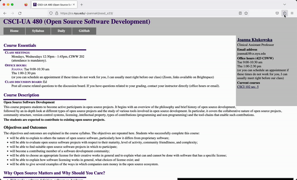
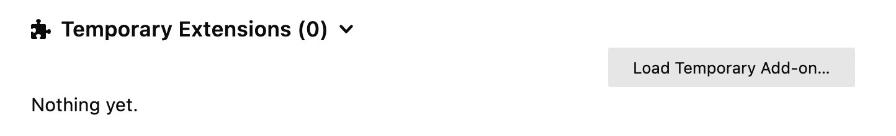
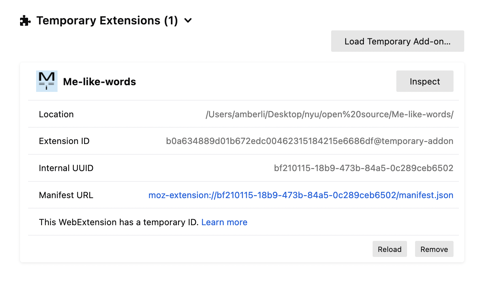

# Overview

Me-like-words is a Firefox extension that encodes and decodes a Caesar cipher, replaces "I" with "Me," replaces links to a cat photo, or does all three things at once! 


 
# How to Install

After downloading the Me-like-words folder,open Firefox and load the `about:debugging#/runtime/this-firefox` page.



Click [Load Temporary Add-on](https://developer.mozilla.org/en-US/Add-ons/WebExtensions/Temporary_Installation_in_Firefox), and select the `manifest.json` file within the Me-like-words folder. 

Your Temporary Extensions section should now look like this:




# How to Use

In the Extensions menu on the tool bar, find the Me-like-words icon. Click on an option, or add a custom input to replace other words. The custom input must be formatted in "Rules:" like this:

```
from,to  
replaceme,imreplaced  
ex1,ex2  
```

Click on an option again to disable.
